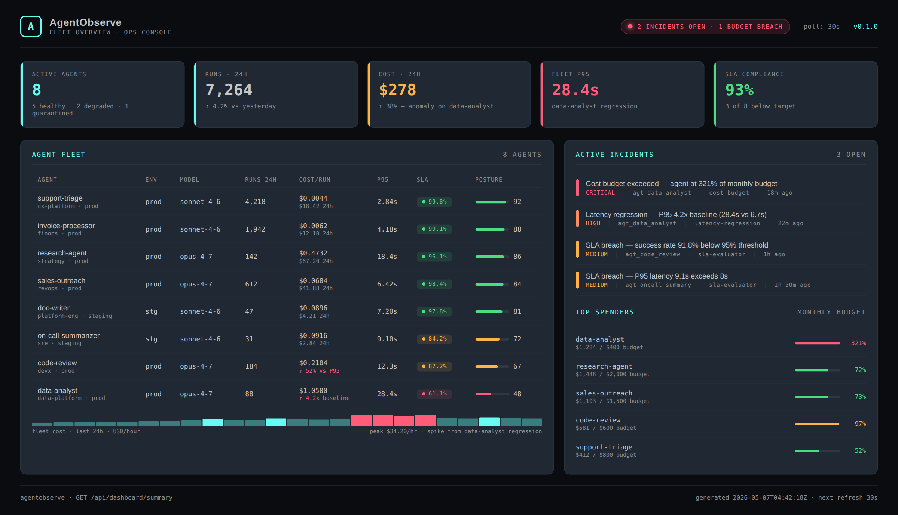
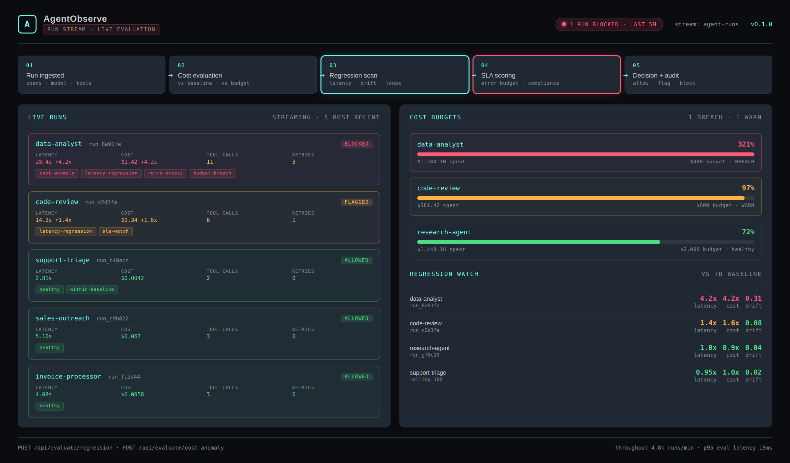
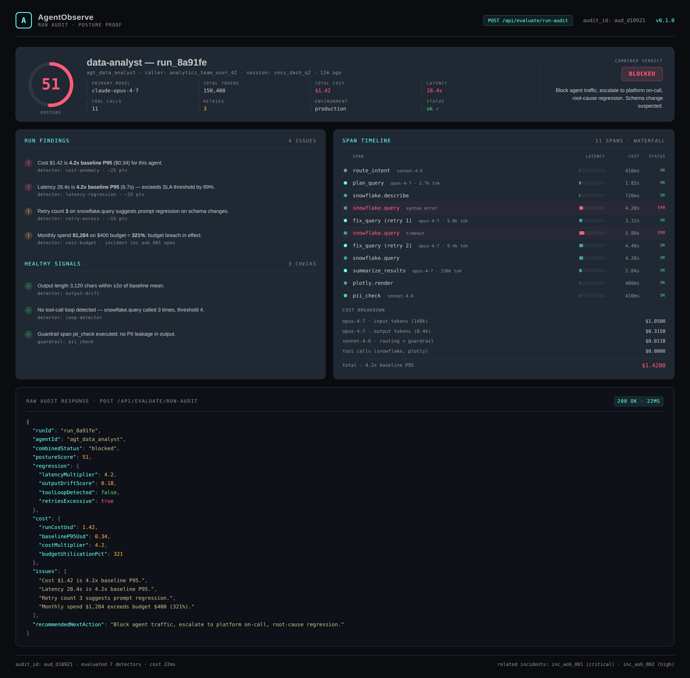

# AgentObserve

Operations console for AI agent fleets — runs, traces, cost budgets, regression detection, SLA scoring, and incident routing. Built for Directors of Platform managing agents in production, not researchers debugging prompts.

> **Recruiter takeaway:**
>
> *"This person treats agent observability as a platform-engineering problem — runtime cost guardrails, latency regressions, SLA error budgets, and on-call routing — not as a prompt-debugging tool. Sister project to [mcp-sentinel](https://github.com/mizcausevic-dev/mcp-sentinel) for the AI Platform Engineering toolkit."*

## Project Overview

| Attribute | Detail |
| --- | --- |
| Runtime | Node.js + TypeScript |
| Framework | Express 5 |
| Domain | AI agent fleet observability and runtime governance |
| Detectors | Cost anomaly · Cost-budget enforcement · Latency regression · Output drift · Tool-loop detection · Retry excess · SLA evaluation |
| Operational Outputs | Run audits · Posture scoring · Incident records · Cost-budget verdicts · SLA reports |
| Data Model | Agent fleet · Runs · Spans · Sessions · Baselines · Incidents |
| Docs | Swagger UI at `/docs` |
| Sister Project | [mcp-sentinel](https://github.com/mizcausevic-dev/mcp-sentinel) — MCP server governance and prompt-injection scanning |

## Executive Summary

AgentObserve models the kind of internal control plane Director-of-Platform teams need once agents start operating fleets of long-running tool-using LLM workflows in production. As agent runs replace deterministic backend services, cost variance per run can swing 10x, latency tails balloon under tool retries, and regressions creep in silently when upstream tool schemas change. Existing AI observability platforms are built for AI engineers debugging individual prompts. AgentObserve is built for the platform owner running a fleet of named agents with monthly budgets, P95 SLAs, error budgets, and an on-call rotation.

The API ingests agent runs and their spans, scores each run against a per-agent baseline, evaluates monthly cost budget utilization, detects latency regressions and tool-call loops, scores SLA compliance with an explicit error-budget remaining percentage, and produces a single combined posture verdict per run with a recommended next action. The output reads like an internal platform capability — opinionated, scoped to fleet operators, and dashboard-first — rather than a generic trace viewer. Domain logic is unit-tested and exposed through versioned routes ready to back a real on-call console.

## Architecture

    Agent run completes (LLM calls + tool calls + spans)
        |
        v
    POST /api/ingest/run
        |
        +--> Request validation (Zod)
        +--> Cost evaluation     (vs baseline P95 + monthly budget)
        +--> Regression scan     (latency / output drift / tool loops / retries)
        +--> SLA scoring         (P95 + success rate + error budget)
        +--> Combined run audit
        |
        v
    Posture decision per run
        |
        +--> production-ready  (no action)
        +--> needs-review      (notify owner, sample more runs)
        +--> blocked           (suspend agent, page on-call, root-cause)

## Governance Workflow

1. Agent runtime emits a finished run with spans, latency, cost, tokens, retries, and tool calls.
2. The service validates the payload shape with Zod schemas.
3. Detectors evaluate each run against per-agent baseline metrics, monthly budget utilization, SLA thresholds, and policy guardrails.
4. The service returns a posture score, a list of issues, a list of healthy signals, a combined run verdict, and a recommended next action.
5. Operators use `/api/dashboard/summary`, `/api/agents`, `/api/runs`, and `/api/incidents` to drive the on-call console and weekly fleet reviews.

## Validation Model

### Cost Anomaly Detection

Cost evaluation per run covers:

- run cost compared to agent baseline P95 (multiplier flag at 1.5x, block at 2.5x)
- projected monthly spend vs declared monthly budget (warn at 80%, block at 100%)
- per-agent budget breach incident creation
- spend velocity tracking against budget burn rate

### Regression Detection

Each finished run is evaluated against:

- latency multiplier vs baseline P95 (regression threshold 1.5x)
- output length z-score drift vs baseline mean and standard deviation
- tool-call loop detection (configurable max repeats per tool, default 4)
- retry excess (3+ retries on a single span family)
- terminal status check (anything other than `ok` deducts posture points)

### SLA Evaluation

Per-agent SLA scoring includes:

- P95 latency vs SLA threshold
- success rate vs SLA threshold
- error budget remaining (computed against allowed error rate)
- aggregate compliance score over the configured window

### Run Audit Decision

The combined run-audit endpoint produces a single operational verdict per run:

- production-ready
- needs-review
- blocked

## API Endpoints

| Method | Endpoint | Purpose |
| --- | --- | --- |
| GET | `/health` | Service status and uptime |
| GET | `/api/agents` | List registered agents in the fleet |
| GET | `/api/agents/:id` | Fetch one agent record |
| GET | `/api/agents/:id/baseline` | Fetch the rolling baseline metrics for one agent |
| GET | `/api/runs` | List recent agent runs |
| GET | `/api/runs/:id` | Fetch a single run with its full span trace |
| GET | `/api/incidents` | List open and recent incidents |
| GET | `/api/dashboard/summary` | Operations summary view |
| POST | `/api/ingest/run` | Ingest a finished agent run with spans |
| POST | `/api/evaluate/regression` | Evaluate a run for latency regression, output drift, and tool loops |
| POST | `/api/evaluate/cost-anomaly` | Evaluate a run cost vs agent baseline P95 and monthly budget |
| POST | `/api/evaluate/sla` | Evaluate agent SLA compliance over a time window |
| POST | `/api/evaluate/run-audit` | Combined posture audit on one run (regression + cost) |

## Sample Validation Request

    POST /api/evaluate/run-audit
    Content-Type: application/json

    {
      "runId": "run_8a91fe"
    }

## Sample Validation Response

    {
      "runId": "run_8a91fe",
      "agentId": "agt_data_analyst",
      "combinedStatus": "blocked",
      "postureScore": 51,
      "regression": {
        "latencyMultiplier": 4.2,
        "outputDriftScore": 0.18,
        "toolLoopDetected": false,
        "retriesExcessive": true
      },
      "cost": {
        "runCostUsd": 1.42,
        "baselineP95Usd": 0.34,
        "costMultiplier": 4.2,
        "budgetUtilizationPct": 321
      },
      "issues": [
        "Cost $1.42 is 4.2x baseline P95.",
        "Latency 28.4s is 4.2x baseline P95.",
        "Retry count 3 suggests prompt regression.",
        "Monthly spend $1,284 exceeds budget $400 (321%)."
      ],
      "recommendedNextAction": "Block agent traffic, escalate to platform on-call, root-cause regression."
    }

## Screenshots

### Fleet Overview

### Run Stream and Live Evaluation

### Run Audit Proof

## Getting Started

### Prerequisites

- Node.js 20+
- npm

### Setup

    git clone https://github.com/mizcausevic-dev/agentobserve.git
    cd agentobserve
    npm install
    cp .env.example .env
    npm run dev

Visit:

- `http://localhost:3001/docs`
- `http://localhost:3001/api/dashboard/summary`
- `http://localhost:3001/api/agents`
- `http://localhost:3001/api/runs/run_8a91fe`

### Run Tests

    npm test

## What This Demonstrates

- Agent observability framed as a fleet-operator problem rather than a prompt-debugging problem
- runtime cost governance with per-agent budgets and budget-burn enforcement
- latency-regression and output-drift detection grounded in per-agent rolling baselines
- explicit SLA model with error-budget accounting, not just a percent-up display
- combined posture verdict per run with a recommended next action — designed to back an on-call console
- production-minded TypeScript API structure with Swagger, unit tests, and policy visibility
- portfolio coherence with [mcp-sentinel](https://github.com/mizcausevic-dev/mcp-sentinel) — Sentinel governs the MCP server surface, AgentObserve governs the agent runs that consume it

## Future Enhancements

- persist runs, spans, baselines, and incidents in PostgreSQL with rolling-window materialized views
- ship a Node and Python SDK so agent runtimes can emit runs in one line
- streamable ingestion endpoint over SSE for live trace viewers
- pluggable detector framework so teams can author custom regression rules
- export incidents to PagerDuty, Slack, and SIEMs through a unified webhook adapter
- bidirectional integration with mcp-sentinel for tool-surface posture context on each run
- multi-tenant control plane with per-team fleet isolation

## Tech Stack

- Node.js
- TypeScript
- Express 5
- Zod
- Swagger / OpenAPI
- Helmet
- CORS
- Morgan
- Node test runner + Supertest

## Portfolio Links

- [LinkedIn](https://www.linkedin.com/in/mizcausevic/)
- [Skills Page](https://mizcausevic.com/skills)
- [Medium](https://medium.com/@mizcausevic)
- [GitHub](https://github.com/mizcausevic-dev)
- [Sister project — mcp-sentinel](https://github.com/mizcausevic-dev/mcp-sentinel)

Part of [mizcausevic-dev's GitHub portfolio](https://github.com/mizcausevic-dev) — demonstrating enterprise platform observability, AI governance, and director-shaped runtime engineering applied to the production AI agent surface.
